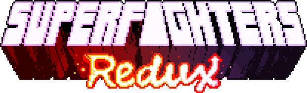
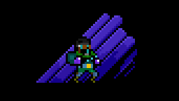
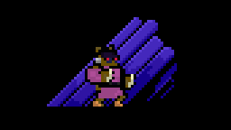
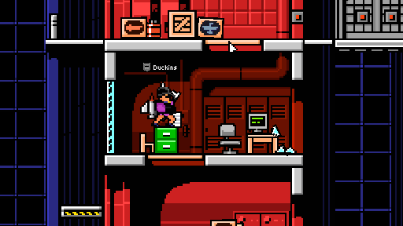
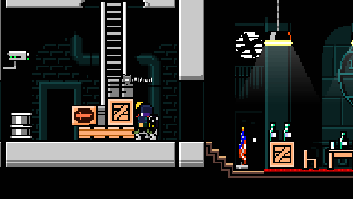

> [!WARNING]
> This mod has been archived. Stay tuned for the next big thing!

---

## 📖 About

**Superfighters Redux** is an open-source mod for [Superfighters Deluxe](https://mythologicinteractive.com/SuperfightersDeluxe). It adds new content and tweaks existing mechanics for a more engaging and dynamic game experience.

## 🎀 Skins

Explore a plethora of new items and colors you can equip. Some skins even feature a tertiary color option.

## 🎯 Weapons

Discover tons of new weapons and makeshift items, each with unique mechanics and effects.

## 🚧 Tiles

Unleash your creativity with a vast collection of new tiles and colors, perfect for custom level design.

## 🚀 Much More

Enjoy new music, sounds, triggers, gore effects, increased slots, special items, and various other enhancements.

---

## 📂 Download

You can download the latest version of Superfighters Redux [here](https://github.com/MythoFrame/SFR/releases).

## ⚙️ Installation

1. Extract the downloaded archive into your `Superfighters Deluxe` folder. If you have a previous SFR installation, ensure it is deleted first.
2. Open Steam and change `Superfighters Deluxe` launch options to `cmd /k "%command%\..\SFR.exe"`.

---

## ✍️ Acknowledgement

- The developers of [Superfighters Deluxe](https://mythologicinteractive.com/SuperfightersDeluxe).
- [Argón](https://github.com/TheOriginalArgon) (Coder).
- Motto73 (Coder).
- [Near Huscarl](https://github.com/NearHuscarl) (Items editor).
- Shock (Artist).
- Dxse (Artist).
- KLI (Artist).
- Casey (Artist).
- Danila015 (Artist).
- Eiga (Balancement, Organizer).
- Samwow (Composer).
- Mimyuu (Special fonts).
- Heapons (Moderator, Tester).
- Olv (Moderator, Tester).
- GoreDemon (Tester).
- Pricey (Tester).
- Emmet Brown (Tester).
- Dark (Tester).
- Everyone else who contributed.

## 🔗 Forks

- [SFDCT](https://github.com/Liokindy/SFDCT) - A mod compatible with vanilla clients with some QoL enhancements.
